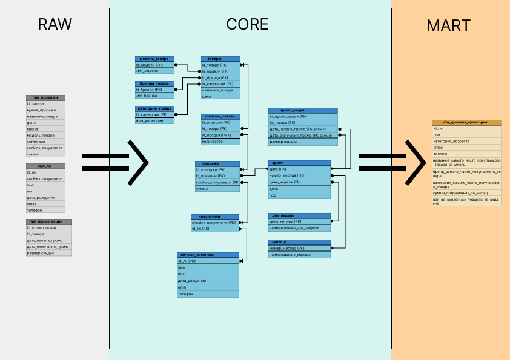
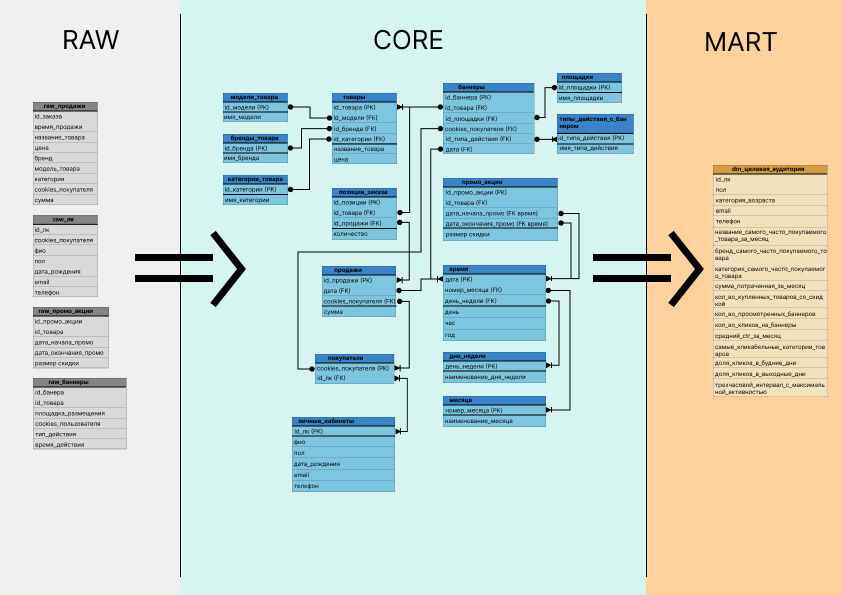

# DWH-schema-1T-Data-training

## Задание
В качестве задания необходимо было спроектировать DWH с использованием слоев `raw`, `core` и `mart`.
Были заданы следующие входные данные:
- **Информация о продажах** (id заказа, время продажи, название товара, цена, бренд, модель товара, категория, cookies покупателя, сумма)
- **Информация о личных кабинетах покупателей** (id личного кабинета, cookies покупателя, ФИО, пол, дата рождения, email, телефон)
- **Информация о промо-акциях** (id промо-акции, id товара, дата начала промо, дата окончания промо, размер скидки)

Эти данные были определены "как есть" в слое `raw`.

Также на входе была определена витрина, которая должна была получиться в слое `mart`, со следующей информацией:
- id личного кабинета
- Пол
- Категория возраста
- Электронная почта
- Телефон
- Товар, который чаще всего покупал клиент за последний месяц
- Бренд и категория товаров, которые чаще всего покупал клиент
- Сумма, потраченная клиентом за месяц
- Количество товаров, купленных со скидкой

На основе этой информации был спроектирован слой `core`, а также оформлено DWH в виде схемы.

## Задание PRO
В качестве следующего задания необходимо было дополнить схему DWH, ориентируясь на следующие дополнительные данные:
- **Данные о прохождении баннерной рекламы** (id баннера, id товара, площадка размещения, cookies пользователя, тип действия (просмотр или клик), время действия).

Также витрина в слое `mart` дополнялась следующей информацией:
- Количество просмотренных баннеров
- Количество кликов на баннеры
- Средний CTR (отношение кликов к просмотрам) за месяц
- Категория товаров, на которые клиенты чаще всего кликают
- Активность клиентов в выходные или будние дни
- Трёхчасовой интервал с максимальной активностью

Учтя эти дополнения в слоях `raw` и `mart`, был доработан слой `core`, что можно видеть на итоговой схеме:

## Дополнение
Ознакомиться с двумя схемами можно по [ссылке на проект в figma](https://www.figma.com/file/eshmZMtRE6R1mj3LDcxjgV/DWH-schema-1T-Data-training?type=design&node-id=0%3A1&mode=design&t=3b51zzLTeoCbj3dJ-1)
